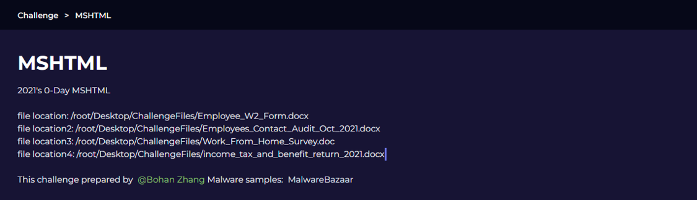
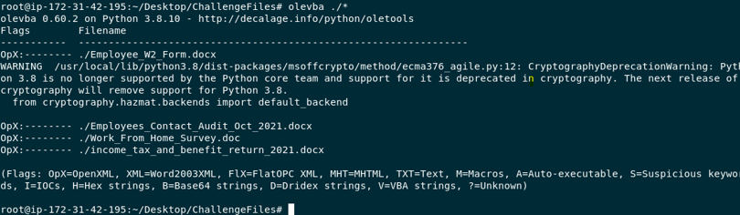
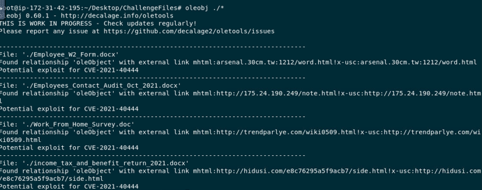
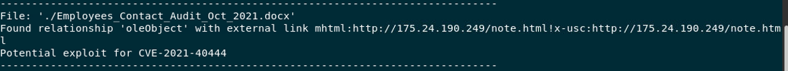
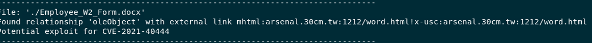
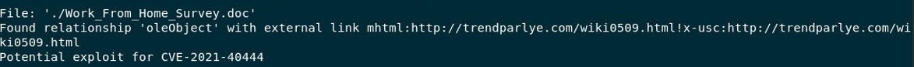
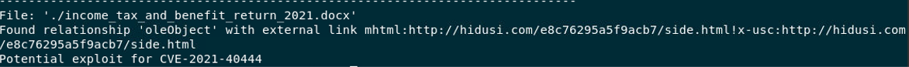

# MSHTML (CVE-2021-40444) - OLE Analysis with oletools

## 1. Tools

The analysis was performed with **oletools**, a Python toolkit by Philippe Lagadec for analyzing OLE files (.doc, .xls, .ppt) and OOXML files (.docx, .xlsx, .pptx). It is used to detect malicious macros, exploits, and suspicious embedded data. The main tools are:

| Tool | Purpose |
|---|---|
| `oleid` | Quickly identifies the file type and checks risk indicators (VBA macros, OLE package, Flash/ActiveX, encryption). Usually run first for an overview. |
| `olevba` | Extracts and deobfuscates VBA macros, and flags suspicious techniques such as AutoOpen, Shell, CreateObject, URLDownloadToFile, and base64/hex obfuscation. |
| `oleobj` | Lists and extracts embedded OLE objects / packages, and detects external links such as `mhtml:...!x-usc:...`, an indicator of CVE-2021-40444. Use `-e` to export payloads. |
| `olemeta` | Extracts OLE metadata (author, creation/modification time, creating application) for attribution. |

## 2. Analysis

`olevba` was run against all four samples first. It reported the files as OpenXML (`OpX`) with no macros, so the exploit is not macro-based.

`oleobj` was then run against the same folder. It found an `oleObject` relationship with an external `mhtml:` link in every sample, and flagged each one as a potential exploit for CVE-2021-40444.

## 3. Questions

**Q1: Examining `Employees_Contact_Audit_Oct_2021.docx`, what is the malicious IP in the docx file?**

**Answer: `175.24.190.249`**

**Q2: Examining `Employee_W2_Form.docx`, what is the malicious domain in the docx file?**

**Answer: `arsenal.30cm.tw`**

**Q3: Examining `Work_From_Home_Survey.doc`, what is the malicious domain in the doc file?**

**Answer: `trendparlye.com`**

**Q4: Examining `income_tax_and_benefit_return_2021.docx`, what is the malicious domain in the docx file?**

**Answer: `hidusi.com`**

**Q5: What is the vulnerability the above files exploited?**

**Answer: CVE-2021-40444**
