# SOC109 - Emotet Malware Detected

The alert was triggered on **2021-03-22** for host **RichardPRD** (`172.16.17.45`). The file `1word.doc` (MD5: `349d13ca99ab03869548d75b99e5a1d0`, 188.95 KB) was flagged under MITRE ATT&CK **T1204** (User Execution). Device Action was recorded as **Cleaned**, indicating the endpoint security solution had already quarantined the file.

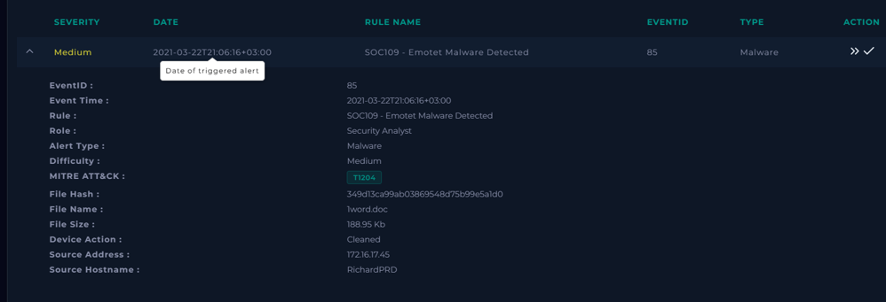

## 1. Taking Ownership

A ticket was created to take ownership of the alert and begin the investigation workflow.

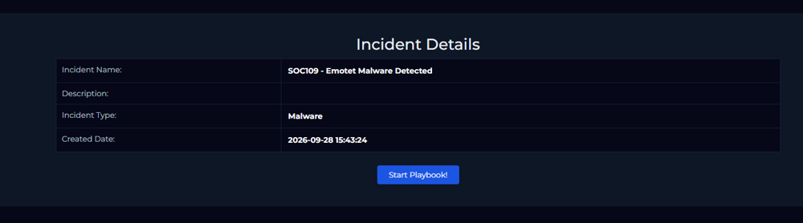

## 2. Checking Quarantine Status

The **Malware Playbook** was launched. The first step asks whether the malware was quarantined/cleaned. Since `Device Action = Cleaned`, the answer is **Quarantined**.

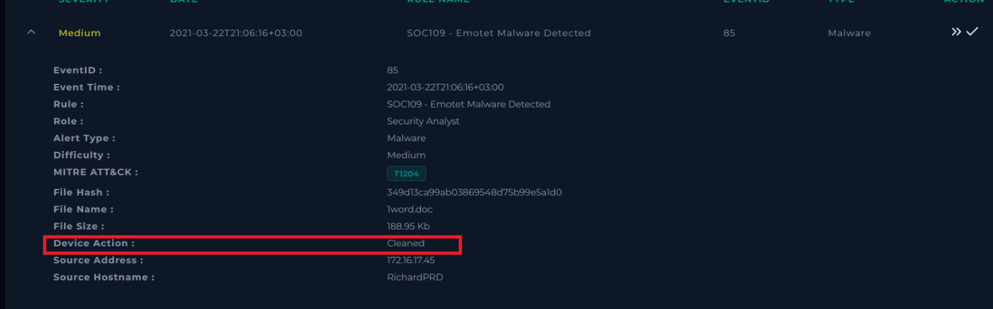

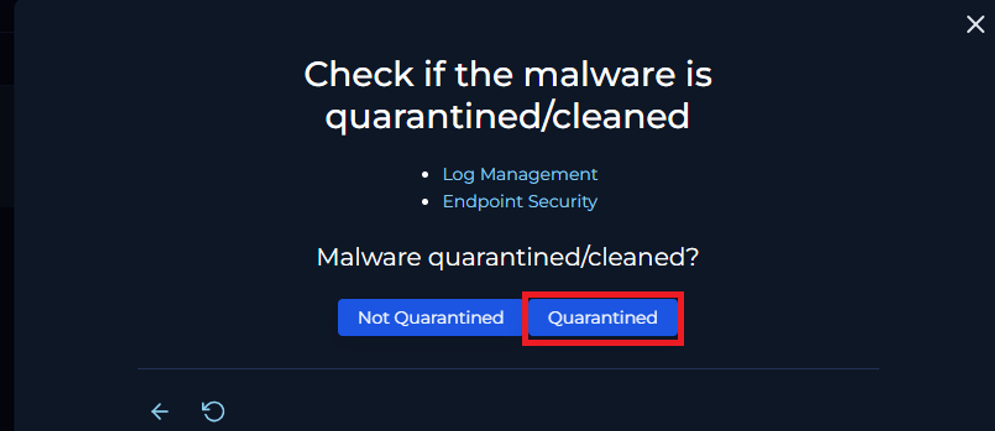

## 3. Threat Intelligence — VirusTotal Analysis

The file hash was submitted to VirusTotal. **51/62 security vendors** flagged `1word.doc` as malicious. The file is tagged as a **Trojan/Downloader/Dropper** associated with the **Emotet** family (`trojan.w97m/emotet`). Behavioral tags include: `obfuscated`, `calls-wmi`, `macros`, `auto-open`, `hide-app`, `executes-dropped-file`.

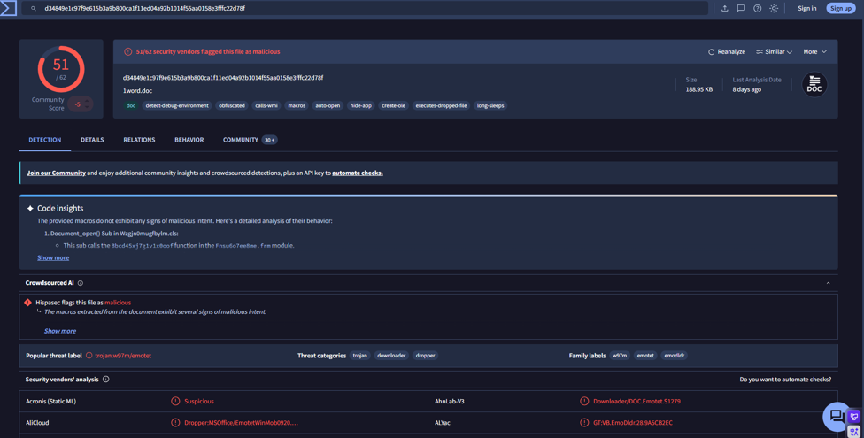

Based on the TI results, the file is confirmed **Malicious** in the playbook.

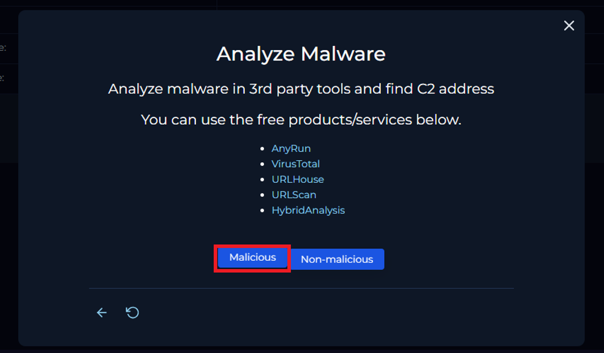

## 4. Log Analysis — Connection Logs

Reviewing the Log Management for `172.16.17.45`, there are **6 Firewall logs** to internal IPs (`172.16.17.35`) on ports 22, 80, 443, 21, 445 — all internal traffic. There is also **1 Proxy log** showing an outbound connection from `172.16.17.45` to `5.135.143.133:443`, which corresponds to the malware download.

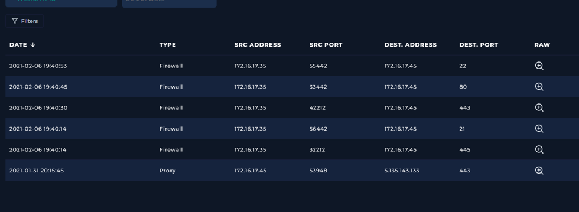

## 5. Threat Intelligence — C2 Address Check

Checking the contacted IPs from the VirusTotal Relations tab reveals **106 contacted IP addresses**. Cross-referencing against the connection logs, the proxy log destination `5.135.143.133` is a suspected C2/download server. None of the observed connection logs match known C2 IPs flagged by TI vendors.

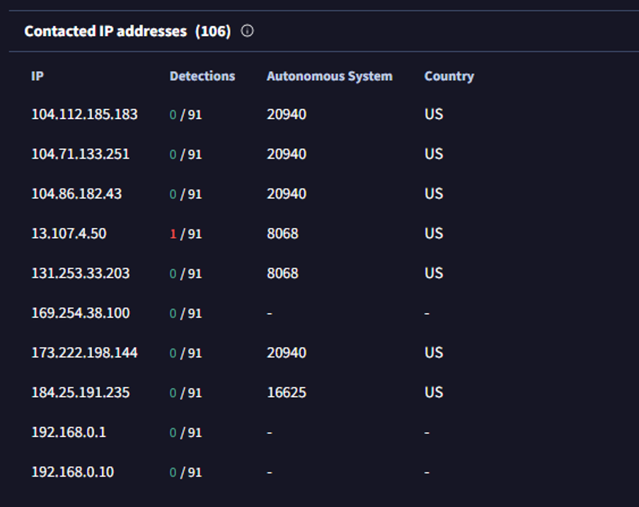

## 6. Playbook — C2 Access Check

The playbook prompts to check Log Management for any C2 access. Since the connection logs show no confirmed C2 communication (the outbound traffic was the initial download, not active C2 beaconing), the result is **Not Accessed**.

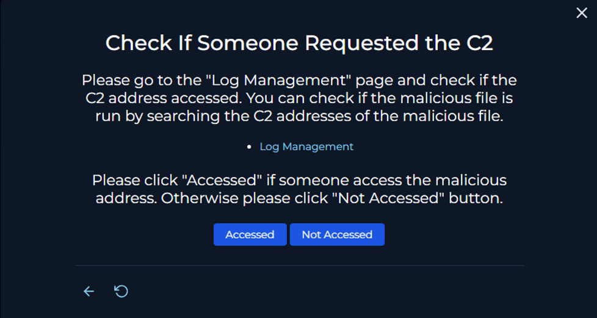

## 7. Artifacts

The following artifacts were added to the case:

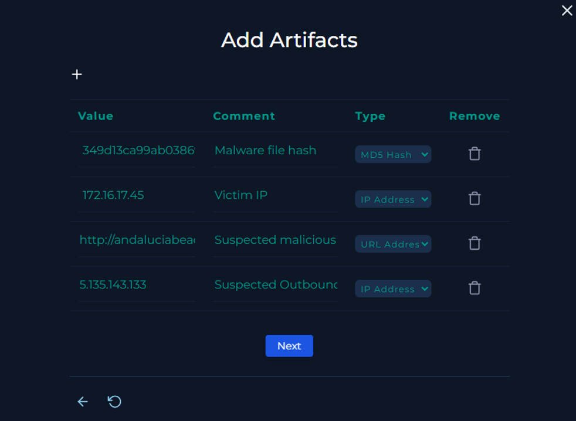

## 8. Analyst Note

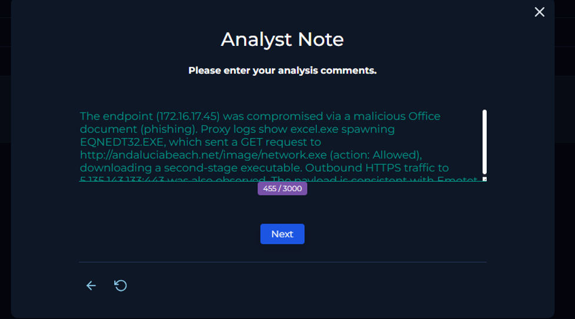

## 9. Result

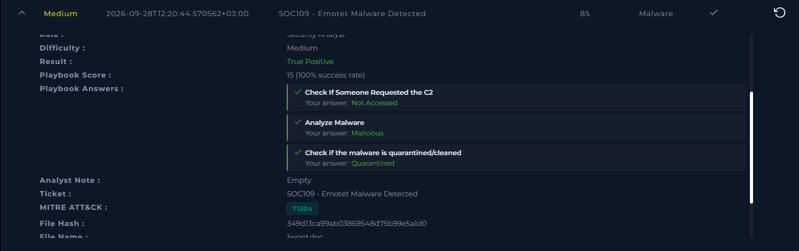
