# SOC168 - Whoami Command Detected in Request Body

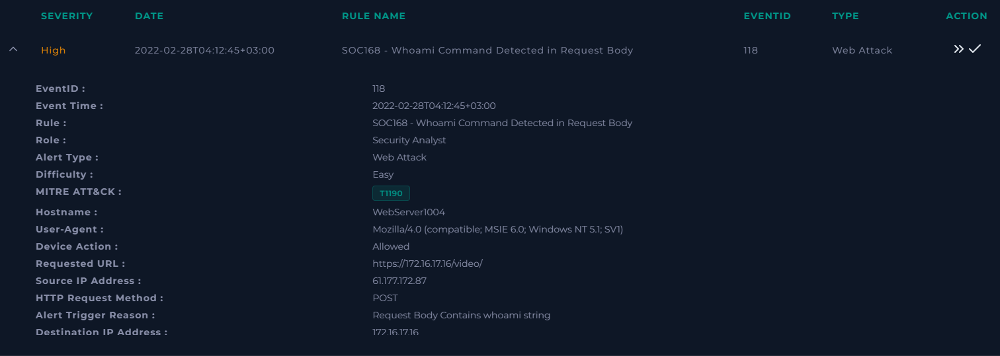

## 1. Taking Ownership

A ticket was created to take ownership of the alert and start the investigation workflow.

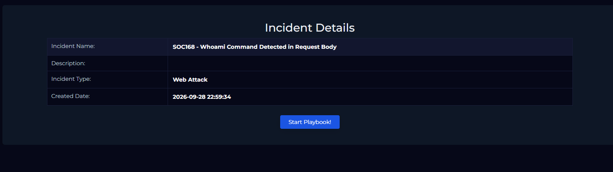

## 2. Understanding Why the Alert Was Triggered

The first step of the playbook is to collect the initial information from the alert itself.

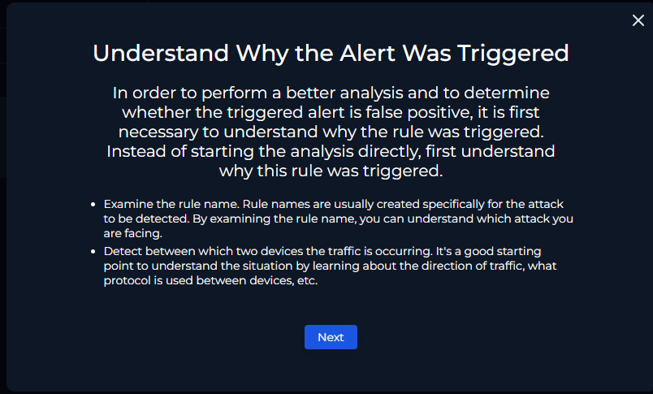

Key observations:

1. **Rule name:** "Whoami Command Detected in Request Body" indicates that the alert was triggered by the string `whoami` appearing in the body of an HTTP request. This is a typical sign of command injection / remote code execution, used to check the privileges of the web server process, and it maps to technique T1190 (Exploit Public-Facing Application).
2. **Traffic direction:**
   - **Source:** 61.177.172.87, a public IP address (external, on the Internet).
   - **Destination:** 172.16.17.16, a private IP address (WebServer1004).
   - **Protocol:** HTTP/HTTPS, using the POST method to the path `/video/`.

## 3. Data Collection

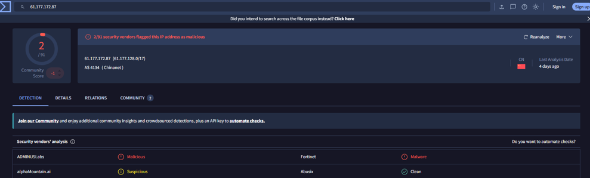

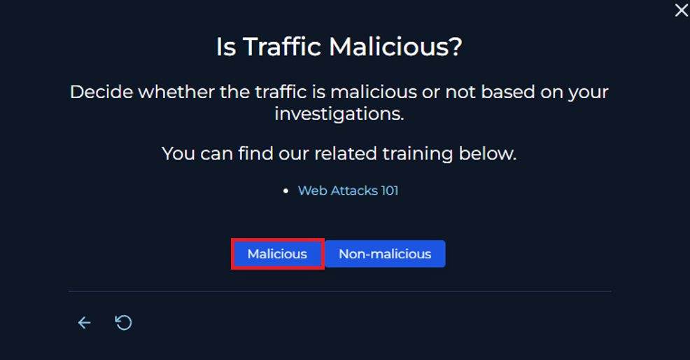

The source IP originates from China and is flagged as malicious by 2 of 91 vendors, so it is classified as **Malicious**.

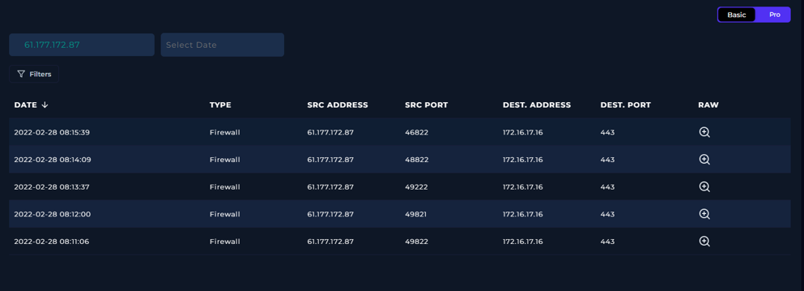

Next, Log Management was searched for the source IP `61.177.172.87`.

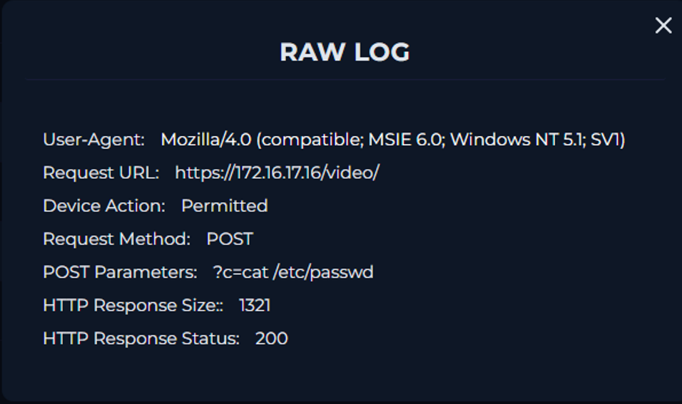

Five firewall events with this source address were found. Each event was reviewed in turn.

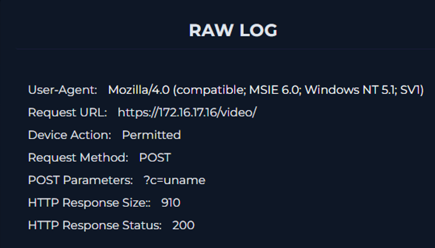

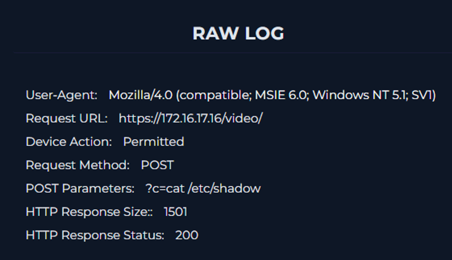

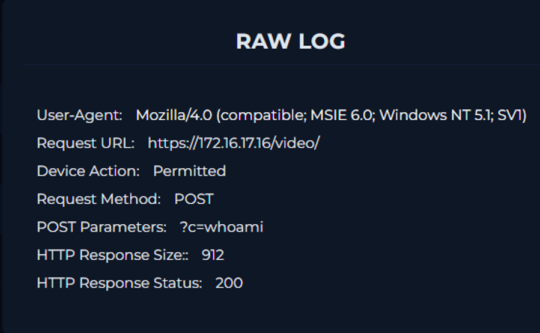

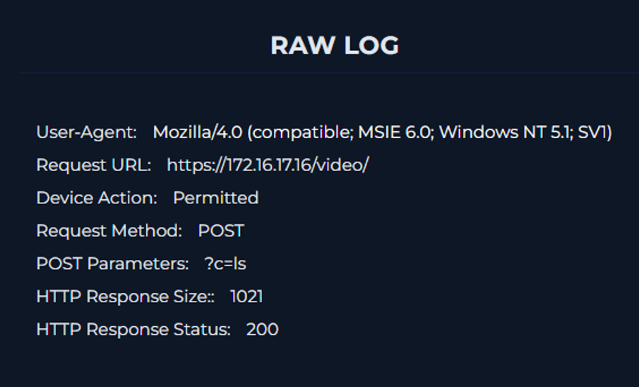

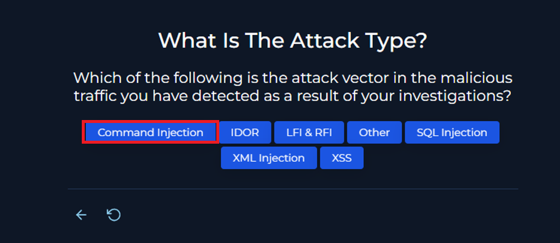

The POST parameters in these logs (`uname`, `whoami`, `ls`, `cat /etc/passwd`, `cat /etc/shadow`) are OS commands, and every response returned HTTP status 200. The attack type is therefore **Command Injection**.

## 4. Planned Test Check

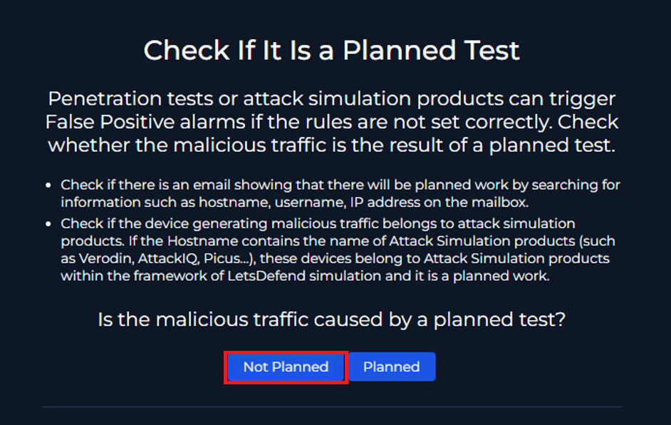

To rule out a penetration test or attack simulation, Email Security was searched for any message related to the suspicious IP. None was found, so the activity is **Not Planned**.

## 5. Traffic Direction

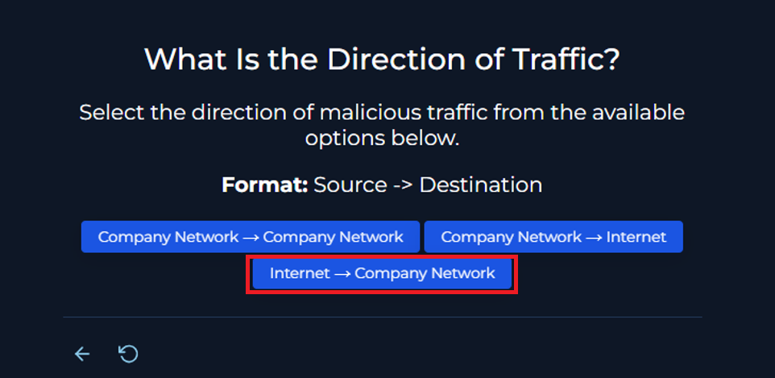

The traffic comes from an external network into the internal one: **Internet -> Company Network**.

## 6. Attack Outcome

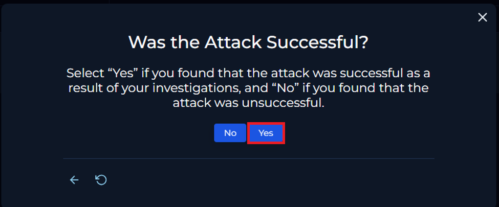

Every request received an HTTP 200 response, so the attack is considered **successful**.

## 7. Containment

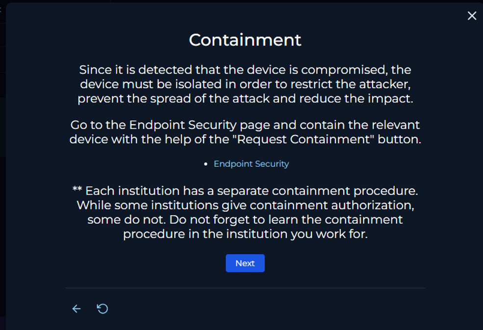

The host **WebServer1004** (`172.16.17.16`) was isolated via **Endpoint Security** using **Request Containment**.

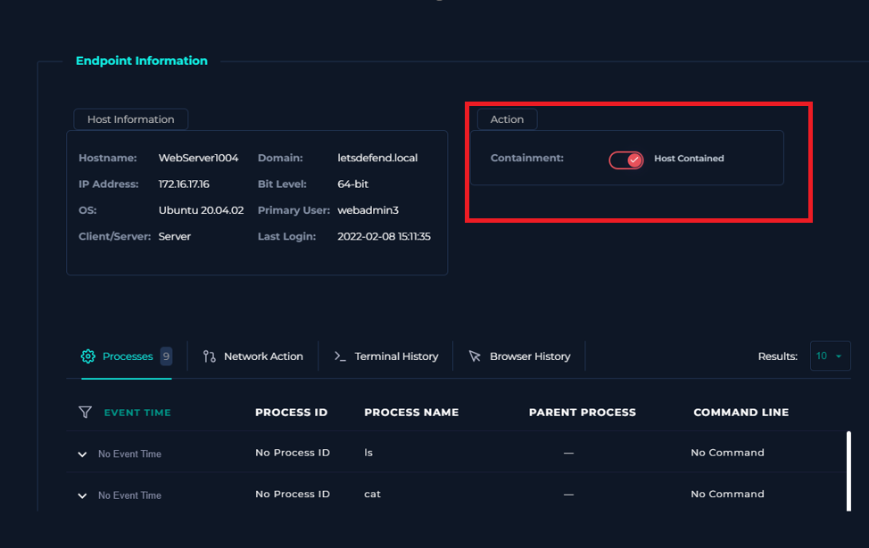

## 8. Artifacts

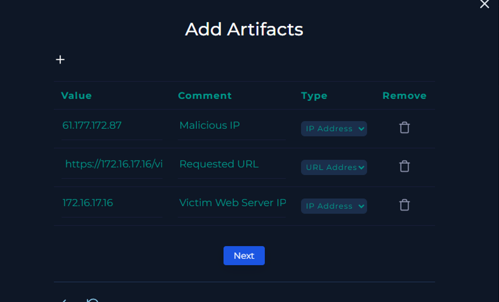

## 9. Escalation

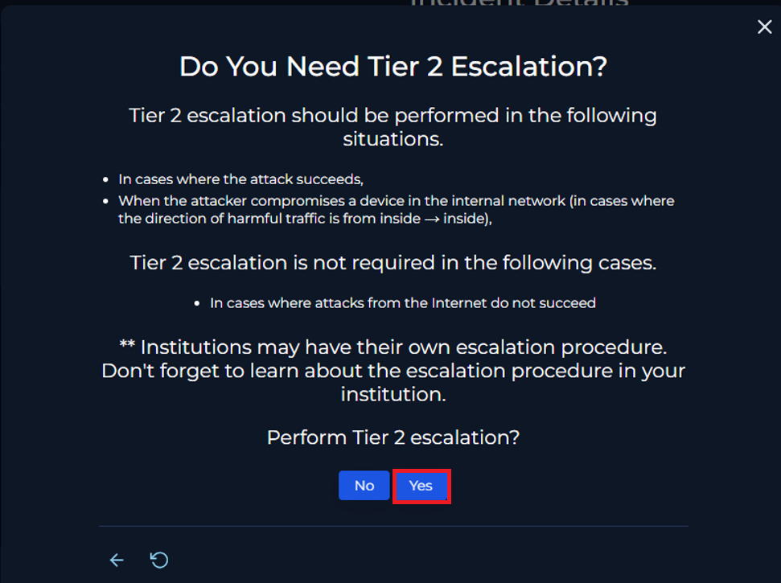

Since the attack was successful, the case was escalated to **Tier 2**.

## 10. Analyst Note

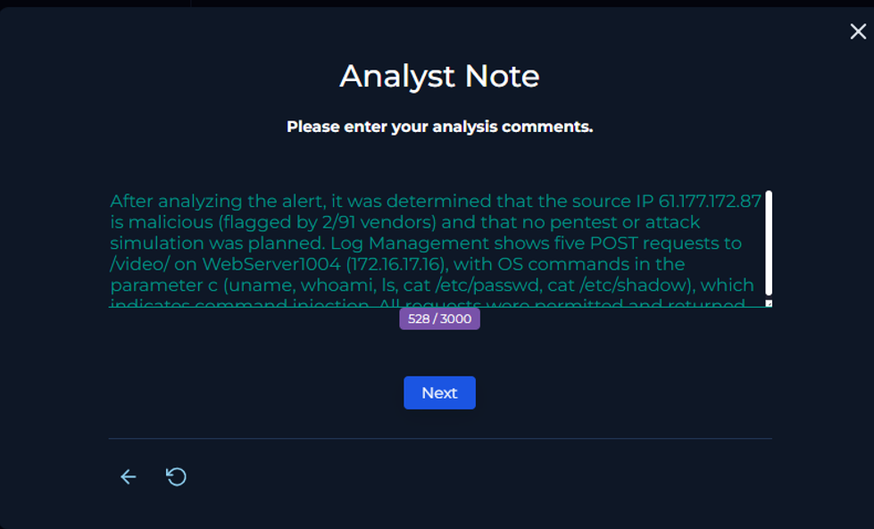

## 11. Final Result

The final result of the investigation is **True Positive**.

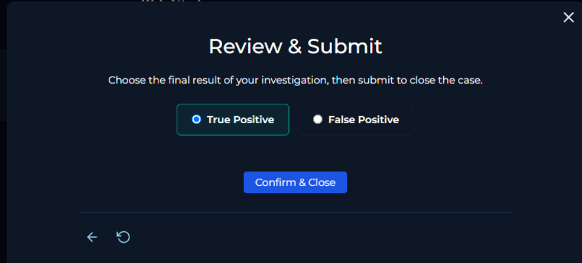

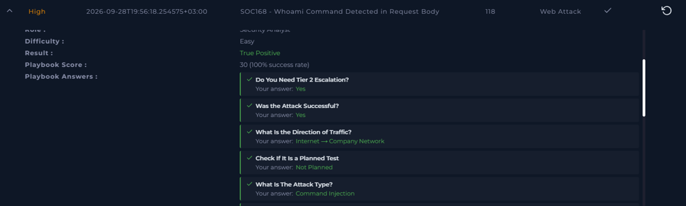
